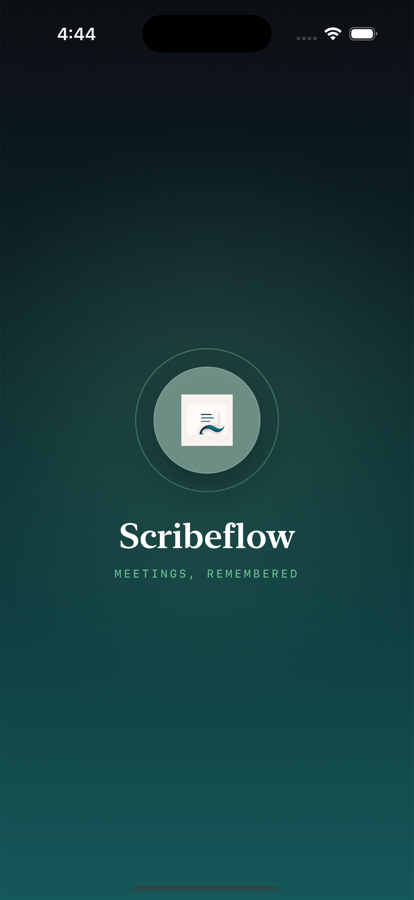
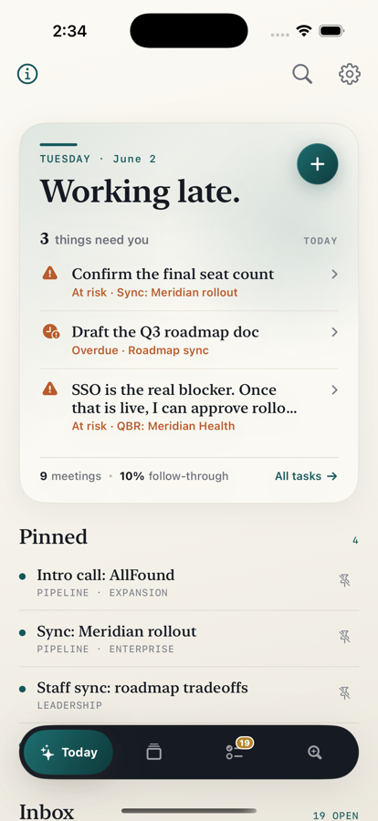
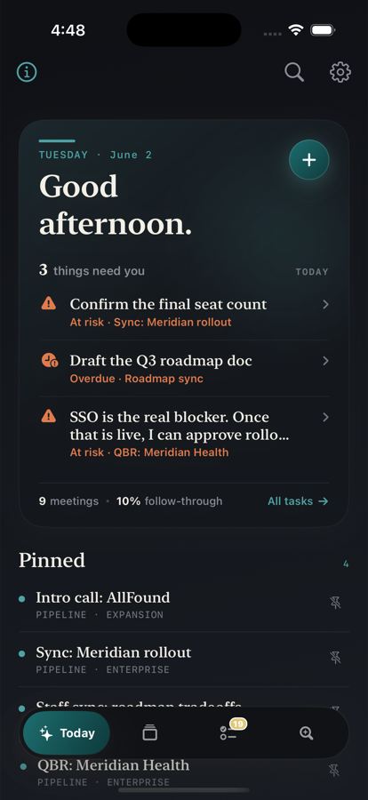
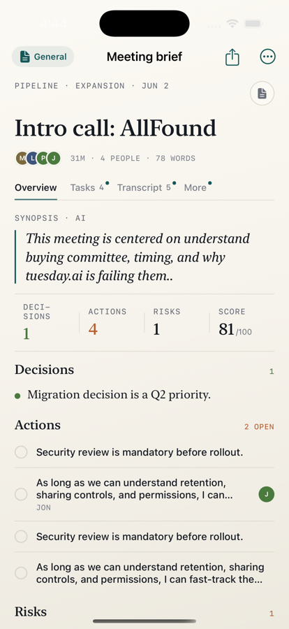
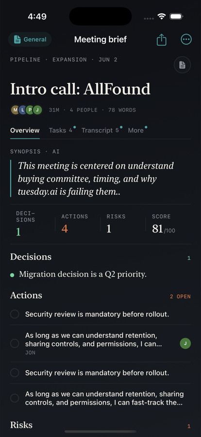
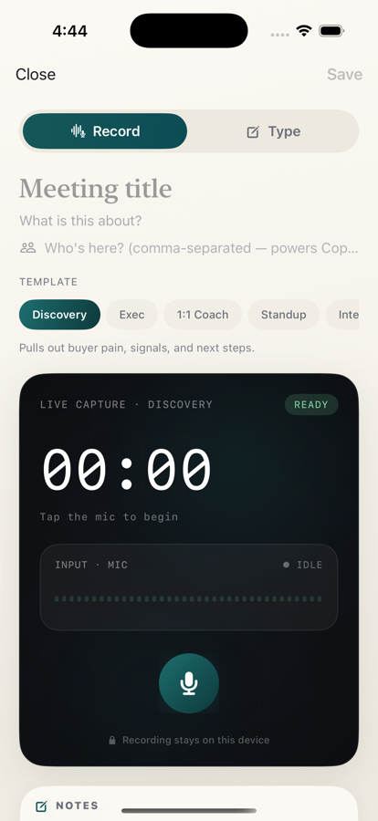
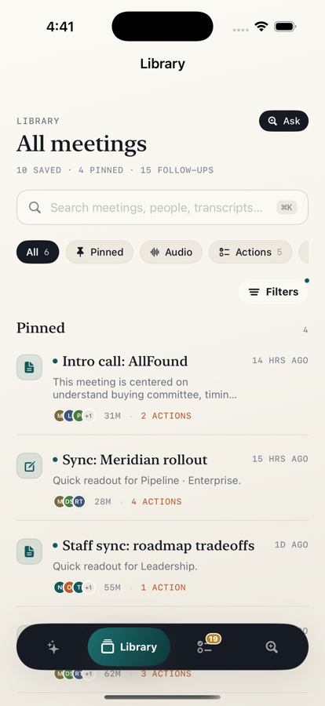
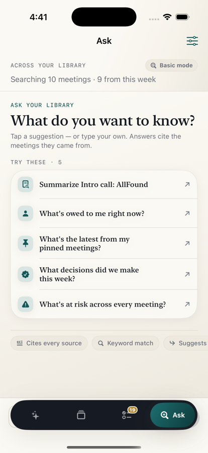

<div align="center">



# Scribeflow

### Meetings, remembered — entirely on your device.

Capture a meeting, and Scribeflow turns rough notes and live speech into a clean recap — **decisions, action items with real owners and due dates, and answers across everything you've ever captured**. No cloud. No server account. It all runs on your iPhone.


</div>

---

## ✨ The flow

From a messy meeting to clean follow-through, in four taps.

<div align="center">

</div>

<table>
<tr>
<td width="25%" align="center"><b>1 · Capture</b><br/><sub>Record or type. On-device transcription, zero ceremony.</sub></td>
<td width="25%" align="center"><b>2 · Auto recap</b><br/><sub>Synopsis, decisions, actions &amp; owners, risks — scored.</sub></td>
<td width="25%" align="center"><b>3 · Today</b><br/><sub>A briefing of what needs you, ranked by real deadlines.</sub></td>
<td width="25%" align="center"><b>4 · Ask</b><br/><sub>Question your library and get cited answers.</sub></td>
</tr>
</table>

---

## Why it's different

Most meeting tools record to the cloud and hand you a transcript. Scribeflow is built around **memory and follow-through**, locally:

- 🧠 **It reads what you wrote** — pulls out the *decision*, the *action*, and *who owns it* (`I'll…` → **You**, `we'll…` → **Team**, `Maya will…` → **Maya**, `owner: Dana` → **Dana**). Not a keyword dump.
- 🗓️ **Real deadlines** — free-text hints like "Friday" or "eod" resolve to actual dates, so *overdue* and *due-soon* are judged by time, not guesses.
- 🔁 **It remembers across meetings** — ask your whole history a question, with cited sources.
- ⚡ **It tells you what matters now** — a ranked briefing, not a wall of numbers.
- 🔒 **Private by design** — recordings, transcripts, and notes never leave the device.

---

## 🌗 Light & dark

Every surface is built on adaptive tokens — it's beautiful in both.

<table>
<tr>
<td width="50%"></td>
<td width="50%"></td>
</tr>
<tr>
<td align="center"><sub>Today · Light</sub></td>
<td align="center"><sub>Today · Dark</sub></td>
</tr>
<tr>
<td width="50%"></td>
<td width="50%"></td>
</tr>
<tr>
<td align="center"><sub>Recap · Light</sub></td>
<td align="center"><sub>Recap · Dark</sub></td>
</tr>
</table>

---

## Highlights

| | |
|---|---|
| **Live capture + transcription** | Record on-device (`SFSpeechRecognizer`) or just type. |
| **Smart Notes** | Decisions & actions with owners and due hints, extracted live as you write. |
| **Meeting Copilot** | During a call, recalls open promises with the same people and flags decisions/actions as they're spoken. |
| **Ask your library** | Retrieval-augmented Q&A across every meeting, with citations and follow-up suggestions. |
| **Real commitments** | Overdue / due-soon judged by resolved dates; floats urgent work to the top. |
| **Cinematic briefing** | A "what needs you today" home, ranked by urgency, with follow-through stats. |
| **One-tap recap** | Share a clean Markdown digest — synopsis · decisions · actions · risks · people. |

---

## More screens

<table>
<tr>
<td width="33%"><p align="center"><sub><b>Capture</b> — calm dark stage, live waveform.</sub></p></td>
<td width="33%"><p align="center"><sub><b>Library</b> — searchable, filtered.</sub></p></td>
<td width="33%"><p align="center"><sub><b>Ask</b> — grounded, cited answers.</sub></p></td>
</tr>
</table>

---

## Tech

- **SwiftUI** · iOS 26 / Xcode 26 · the Observation framework (`@Observable`)
- **Apple Intelligence** (`FoundationModels`) for note transformation & Q&A, with a deterministic on-device fallback
- **Speech** (`SFSpeechRecognizer`) + `AVAudioEngine` for live capture
- Local JSON persistence — debounced, off-main writes with a backup/recovery path
- **Swift Testing** for the extraction, due-date, and Copilot logic

## Build & run

```bash
open Scribeflow.xcodeproj
# Select an iOS 26 simulator (e.g. iPhone 16 Pro) and ⌘R
```

Explore with sample data (dev only — loads into a fresh install):

```
-SCRIBEFLOW_USE_SEED_DATA
```

## Tests

```bash
xcodebuild test \
  -project Scribeflow.xcodeproj -scheme Scribeflow \
  -destination 'platform=iOS Simulator,name=iPhone 16 Pro'
```

Covers note→intelligence extraction (`MeetingExtractionTests`), due-date resolution (`DueDateTests`), and Copilot recall (`MeetingCopilotTests`).

## Privacy

Recordings, transcripts, and notes stay on the device — nothing is uploaded to a Scribeflow server. Speech recognition runs on-device; calendar access is optional and used only to pre-fill meeting context.

## License

© 2026 Jaskaran Singh. **All rights reserved.** The source is published for viewing only — see [LICENSE](LICENSE). It is not licensed for reuse, redistribution, or derivative works without written permission.

<div align="center">
<sub>Built by Jaskaran Singh · SwiftUI · on-device AI · made to be remembered.</sub>
</div>
