

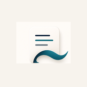

# Scribeflow

**Private meeting memory that proves what happened and closes the loop.**

Capture a conversation, understand what matters, verify every important claim,
and keep commitments moving. Personal notes stay personal. Meeting intelligence
stays tied to editable source evidence.

<table>
<tr>
<td width="33%" align="center">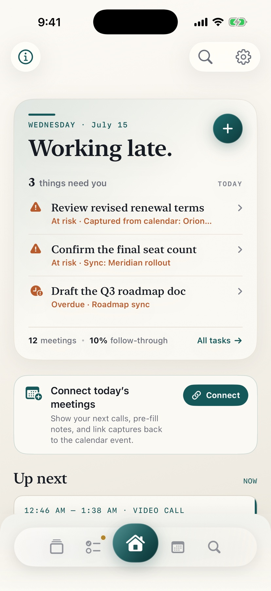</td>
<td width="33%" align="center">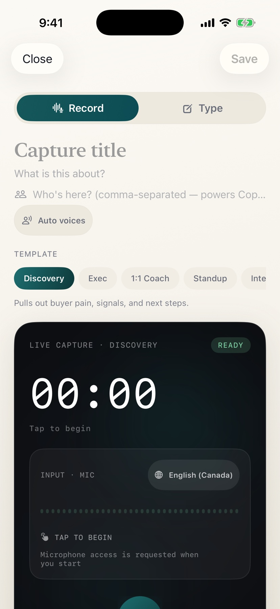</td>
<td width="33%" align="center">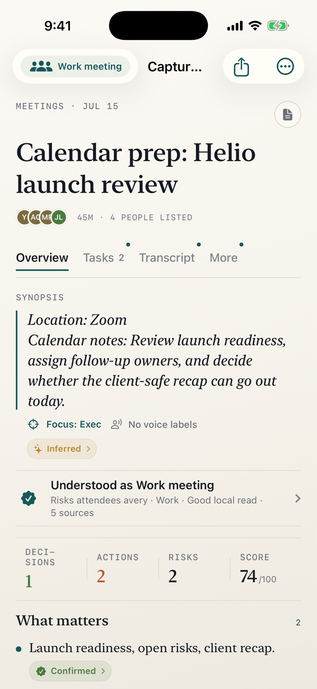</td>
</tr>
<tr>
<td align="center"><b>Know what needs you</b> A calm daily briefing across meetings, risks, and follow-ups.</td>
<td align="center"><b>Capture naturally</b> Record, type, choose a meeting lens, and guide the expected voice count.</td>
<td align="center"><b>Review with proof</b> See purpose, confidence, sources, decisions, and the next action.</td>
</tr>
</table>

## What Scribeflow does

Scribeflow is a SwiftUI meeting assistant for iPhone. It brings preparation,
capture, transcription, structured notes, reminders, calendar context, and
source-backed recall into one local-first workflow.

- **Prepares the next conversation.** Calendar events can carry forward related
  decisions, unresolved questions, and open promises from saved notes.
- **Understands the capture before extracting.** Personal thoughts are not forced
  into fake tasks, risks, owners, or decisions.
- **Separates voices without pretending to know identities.** On-device
  diarization can produce speaker turns; every label remains editable.
- **Treats AI output as a claim, not magic.** Important insights can show their
  source, match strength, speaker, and confidence state.
- **Closes the loop.** Commitments remain visible in Today and Tasks, support
  reminders, and deep-link back to the meeting that created them.
- **Keeps the user in control.** The local workspace needs no account. Export,
  private backup, calendar access, notifications, webhooks, and configured
  transcription services are explicit boundaries.

## The complete workflow

~~~mermaid
flowchart LR
    A["Audio, typed notes, or calendar context"] --> B["Speech and note pipeline"]
    B --> C["Purpose and evidence validation"]
    C --> D["Source-backed meeting brief"]
    D --> E["Today and Tasks"]
    D --> F["Calendar and meeting prep"]
    D --> G["Ask with cited sources"]
    D --> H["Local library and recovery"]
    I["Optional configured services"] -. "Consent and configuration" .-> B
    H -. "User controlled" .-> J["Export or private backup"]
~~~

The save path is intentionally short. A pending note appears immediately, the
recording is secured into a durable queue, and final captions no longer block
dismissal. Processing can continue after the user closes the save flow. Failed
transcription work survives relaunch and can be retried without blocking the
main interface.

## Calendar and preparation

The calendar is a working surface, not a read-only list. Month, week, and agenda
modes combine saved notes, EventKit events, and open loops. Filters and
next-busy-day navigation keep dense schedules usable.

Before a meeting, Scribeflow looks for strong people, title, agenda, and recency
matches. Weak matches are deliberately left out instead of being presented as
history.

<table>
<tr>
<td width="50%" align="center">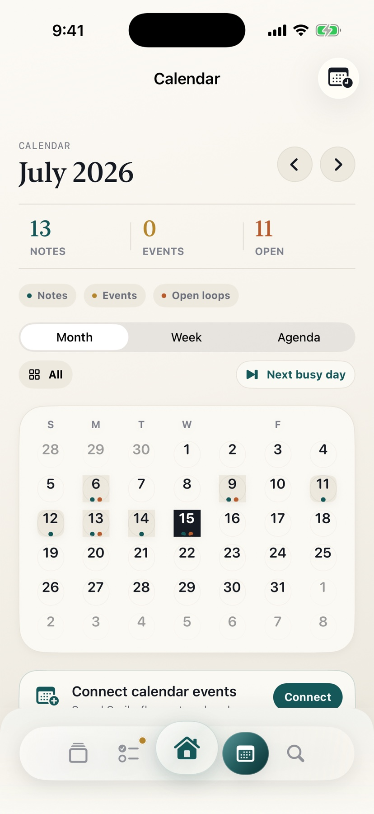</td>
<td width="50%" align="center">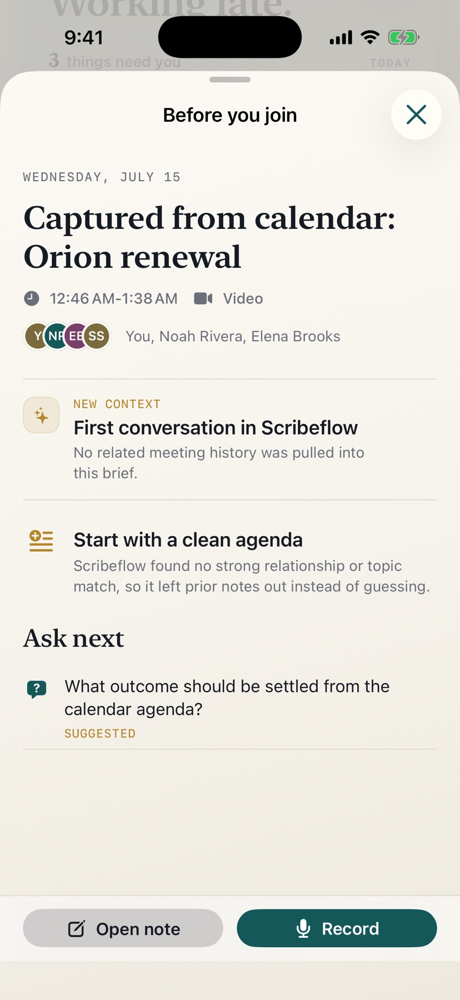</td>
</tr>
<tr>
<td align="center"><b>Interactive calendar</b> Notes, events, and open loops in month, week, or agenda mode.</td>
<td align="center"><b>Before you join</b> Relevant context when it is supported; a clean agenda when it is not.</td>
</tr>
</table>

## Capture and speaker intelligence

Capture starts in Record or Type mode. Meeting lenses shape the brief for
discovery calls, executive reviews, one-to-ones, standups, interviews, and
brainstorms. Users can leave voice detection automatic or provide an expected
count from one to six to guide local clustering.

Enhanced transcription can use FluidAudio for ordered speaker turns on device.
Its speech and speaker models may download on first use; Low Power Mode, thermal
pressure, or less than 1 GB of available storage automatically selects Apple
Speech instead. Apple Speech also remains the compatibility path when
diarization is unavailable.
Speaker labels describe transcript turns, not biometric identity, and can be
renamed or corrected before sharing.

<table>
<tr>
<td width="33%" align="center">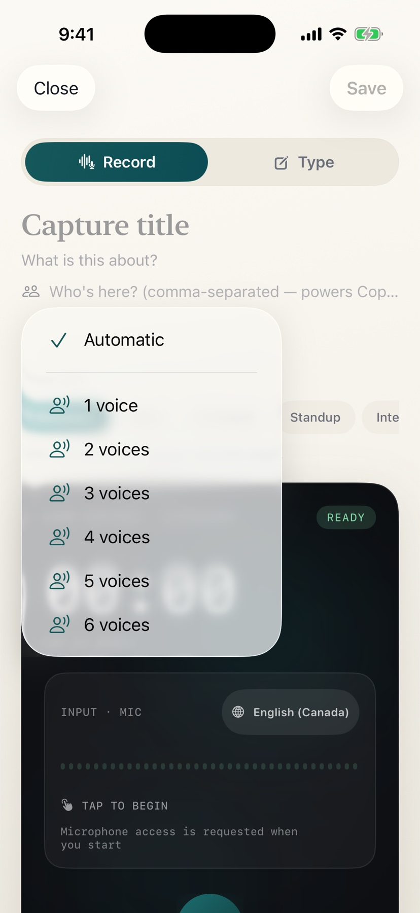</td>
<td width="33%" align="center">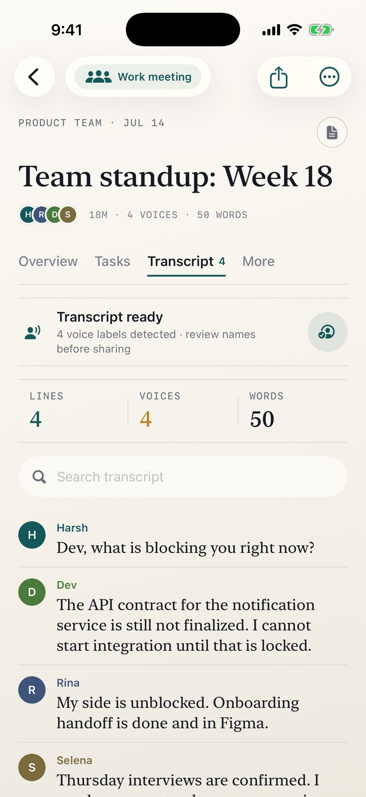</td>
<td width="33%" align="center">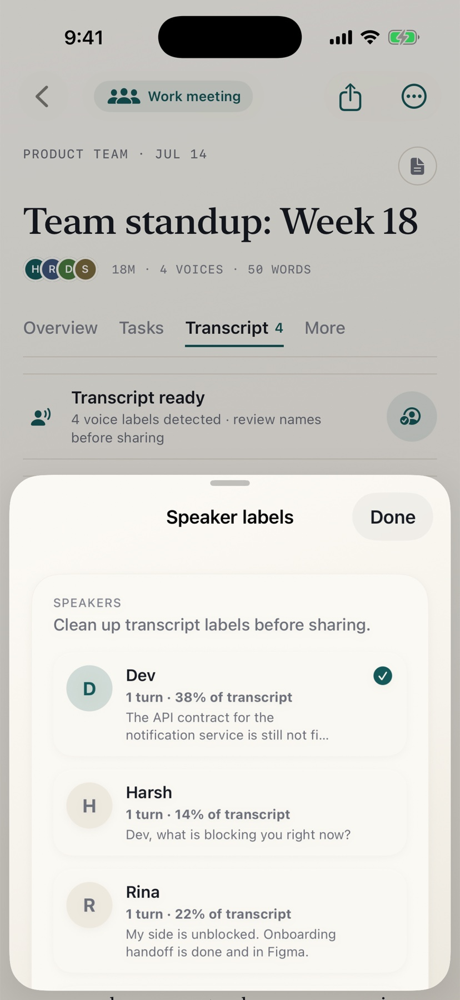</td>
</tr>
<tr>
<td align="center"><b>Guide the room</b> Automatic detection or a one-to-six voice hint.</td>
<td align="center"><b>Read the conversation</b> Ordered turns, searchable text, and visible voice counts.</td>
<td align="center"><b>Correct before sharing</b> Rename a label across the transcript without inventing identity.</td>
</tr>
</table>

## Intelligence you can inspect

The brief changes with the capture's purpose. Work meetings can surface a
synopsis, decisions, actions, risks, questions, and a ranked **What matters**
layer. Personal notes keep a lighter shape with cleaned text and searchable
context.

Every generated point follows the same policy:

~~~text
Copied from one saved source      -> Direct source
Supported by one source excerpt   -> Partial match
Useful surrounding material      -> Context only
No defensible evidence            -> Omit or mark for review
~~~

User-authored notes remain distinct from generated context. Regeneration
preserves completed tasks, reminder state, speaker corrections, and other user
edits instead of silently replacing them.

## Follow-through and recall

Tasks aggregates commitments across meetings and calls. It separates open,
at-risk, overdue, due-soon, completed, and skipped work while retaining owner,
priority, due date, rationale, and source meeting.

Ask retrieves note and transcript excerpts before generating an answer. Only
validated source identifiers can appear as citations, and each source row opens
the exact saved meeting evidence.

<table>
<tr>
<td width="50%" align="center">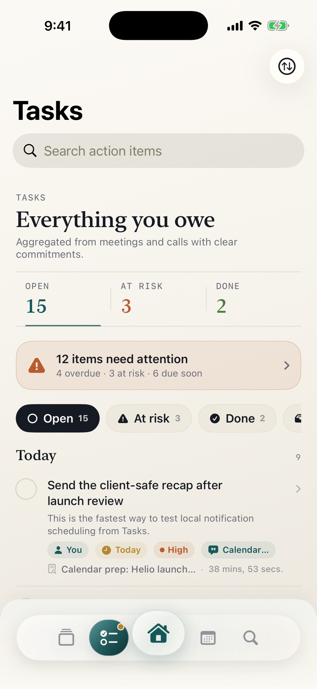</td>
<td width="50%" align="center">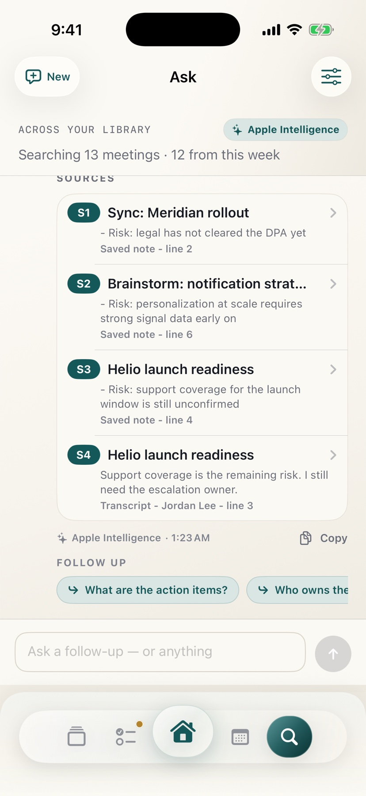</td>
</tr>
<tr>
<td align="center"><b>Follow through</b> Owners, due dates, priority, rationale, reminders, and source meetings.</td>
<td align="center"><b>Answers with evidence</b> Saved-note and transcript citations with speaker and line context.</td>
</tr>
</table>

## A library that becomes memory

Search spans titles, people, notes, and transcripts. Pinned meetings, audio,
actions, owed-to-me items, folders, and filters keep a growing library
navigable. Ask can start from the whole workspace or from one meeting.

<table>
<tr>
<td width="50%" align="center">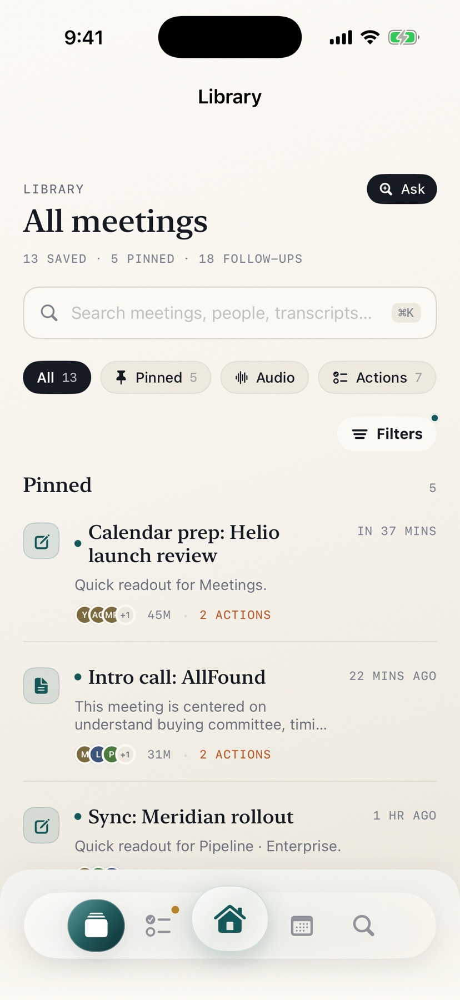</td>
<td width="50%" align="center">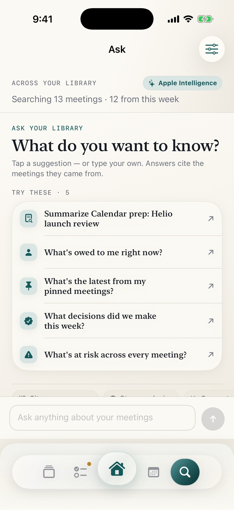</td>
</tr>
<tr>
<td align="center"><b>Find the record</b> Search, filters, pinned notes, people, transcripts, and follow-ups.</td>
<td align="center"><b>Ask the history</b> Workspace questions, suggested prompts, and private on-device answers.</td>
</tr>
</table>

## Light and dark

The interface uses adaptive color, Dynamic Type, larger interaction targets,
and reduced-transparency fallbacks. The root dock stays stable while content
receives enough bottom clearance to scroll completely above it.

## Technical foundation

| Area | Implementation |
|---|---|
| Interface | SwiftUI, Observation, adaptive design tokens, Liquid Glass where available |
| Speech | Modern Apple Speech pipeline with legacy compatibility and contextual vocabulary |
| Speaker turns | FluidAudio local diarization with constrained clustering and editable labels |
| Intelligence | Foundation Models guided generation on supported devices with deterministic fallback |
| Grounding | Purpose classification, raw-source retrieval, validated citations, confidence states |
| Persistence | Local JSON library, digest-deduplicated off-main writes, protected recovery, staged restore |
| Scheduling | EventKit calendar context, Reminders export, UserNotifications follow-through |
| Discovery | Core Spotlight and App Intents for capture, search, and recent-meeting shortcuts |
| Operations | MetricKit archive, app-health checks, diagnostics export, durable retry queues |
| Security | Keychain-backed sessions and secrets, optional app lock, privacy manifest |
| Backend boundary | Optional HTTPS transcription endpoint, backend-issued token, streamed upload |

Latency-sensitive work is kept away from typing, scrolling, and first paint:
derived intelligence migrates gradually, persistence skips identical snapshots,
analytics writes are opt-in and debounced off the main actor, calendar reads run
asynchronously, and recall reuses a revision-cached source index.

Portable notes-only backups scale independently of recording size. The legacy
single-file full export is preflighted and limited to 64 MB of embedded audio so
it cannot allocate an unbounded Base64 package. Private iCloud backup, when the
signed capability is enabled, is notes-only; recordings remain user-controlled.

## Run locally

Requirements:

- Xcode 26 recommended for the latest Foundation Models and Liquid Glass paths.
- An iOS 17 or newer target. iOS 26 enables the newest system intelligence and
  visual capabilities.
- No account or backend is required for the local workspace.

~~~bash
git clone https://github.com/JaskaranChana/meeting-notes.git
cd meeting-notes
open Scribeflow.xcodeproj
~~~

Select an iPhone simulator and run the **Scribeflow** scheme. A command-line
build:

~~~bash
xcodebuild \
  -project Scribeflow.xcodeproj \
  -scheme Scribeflow \
  -configuration Debug \
  -destination 'generic/platform=iOS Simulator' \
  -derivedDataPath /tmp/scribeflow-derived \
  build
~~~

For a clean development simulator, add this launch argument to load the curated
workspace used throughout the screenshots:

~~~text
-SCRIBEFLOW_USE_SEED_DATA
~~~

Sample data and the repeatable investor workspace are also available from
Settings in Debug builds.

## Product boundaries

Scribeflow is explicit about what is local, optional, and externally gated.

- Recordings, transcripts, notes, derived intelligence, and automatic snapshots
  stay local by default.
- Apple frameworks may apply their own system processing rules when the user
  grants Speech, Calendar, Reminders, or notification access.
- Remote transcription is used only in builds with a configured HTTPS service
  and after the existing consent preference is enabled.
- The private CloudKit backup foundation is present, but the app must not claim
  live iCloud backup until the Apple container, entitlement, profile, and
  production schema are provisioned.
- iOS does not allow Scribeflow to capture cellular, FaceTime, WhatsApp, or audio
  from another app. Recording consent remains the user's responsibility.
- Speaker labels are editable transcript clusters, not voiceprints or verified
  identities.

Read the full [privacy policy](PRIVACY.md), [terms](TERMS.md), and
[production configuration contract](PRODUCTION_CONFIGURATION.md).

## Project references

- [Source map](Scribeflow/SOURCE_MAP.md): fastest route to each product area.
- [Phase execution](SCRIBEFLOW_PHASE_EXECUTION.md): completed work and external gates.
- [Investor readiness](INVESTOR_READINESS.md): repeatable demo and release checklist.
- [QA checklist](QA_CHECKLIST.md): focused device and workflow validation.

## License

(c) 2026 Jaskaran Singh. All rights reserved.

The source is published for viewing only and is not licensed for reuse,
redistribution, or commercial deployment without written permission. See
[LICENSE](LICENSE).

Created and maintained by Jaskaran Singh.

